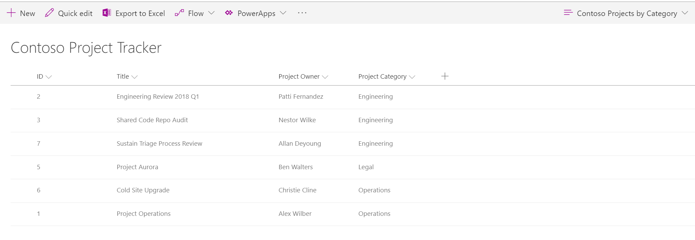

# Create Advanced Lists - addSPFieldXml usage

## Summary

This sample is another example illustrating several new list actions and associated subactions:

* `createSiteColumn` - you can now define and add site columns. A site column is a reusable column definition, or template, that you can assign to multiple lists across multiple SharePoint sites. Supported subactions include designating the field type, display name, internal name, column grouping, and whether the field is required and must enforce unique values.

* `addSiteColumn` - use this action to add a site column to a declared content type.

* `addSPFieldXml` - this action allows you to use Field element XML to define other internal data types and declare within a site script. Note: as of April 2018 we don't yet allow defining this constructed field as a site column or adding to a content type. For more info see https://msdn.microsoft.com/en-us/library/office/ms437580.aspx

* `addSPView` - you can create custom views of libraries and lists to organize and show items that are most important to you (like certain columns) or to add filtering or sorting. Use this action to specify the desired columns and how you want the items displayed (using a CAML query). Subactions allow you to specify row limits, whether the view is paged, and recurses over items in nested folders or not. You can also designate your constructed view as the default. 

* `removeSPView` - this action allows you to remove default or created views by name.

This sample illustrates these site script actions by creating a custom project tracking list. It declares a site column of data type user and then a choice field for project categories using Field XML. It then constructs a new default view that sorts list records first by project category and then by project owner. It then removes the previous default "all items" view. 

## Sample

Solution|Author(s)
--------|---------
list-configured-sitecolumn-fieldxml.json | SharePoint Team

## Version history

Version|Date|Comments
-------|----|--------
1.0|April 10, 2018|Initial release

## Disclaimer
**THIS CODE IS PROVIDED *AS IS* WITHOUT WARRANTY OF ANY KIND, EITHER EXPRESS OR IMPLIED, INCLUDING ANY IMPLIED WARRANTIES OF FITNESS FOR A PARTICULAR PURPOSE, MERCHANTABILITY, OR NON-INFRINGEMENT.**

---

All applied actions in the json file as below

